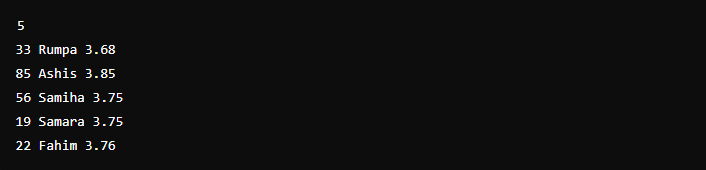
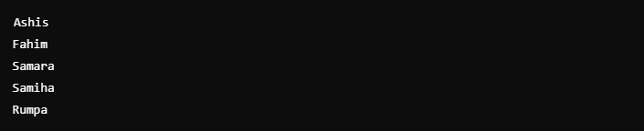

# Ordenar lista em Java

O código é sobre um desafio de programação em Java para ordenar uma lista de estudantes com base em três critérios:
- CGPA (Coeficiente de Rendimento): A lista deve ser organizada em ordem decrescente do CGPA.
- Nome: Se dois estudantes tiverem o mesmo CGPA, a ordem será feita de acordo com o nome em ordem alfabética.
- ID: Se ambos os estudantes tiverem o mesmo nome e CGPA, a ordem será determinada pelo ID, que é único para cada estudante.

### Formato de entrada:
- A primeira linha contém um número inteiro representando o total de estudantes.
- As linhas subsequentes apresentam as informações dos estudantes no formato: ID, Nome e CGPA.

### Formato de saída:
- Depois de aplicar a ordenação, o programa deve imprimir o nome de cada estudante em uma nova linha.

### Exemplo:
Entrada:\

Saída:\

